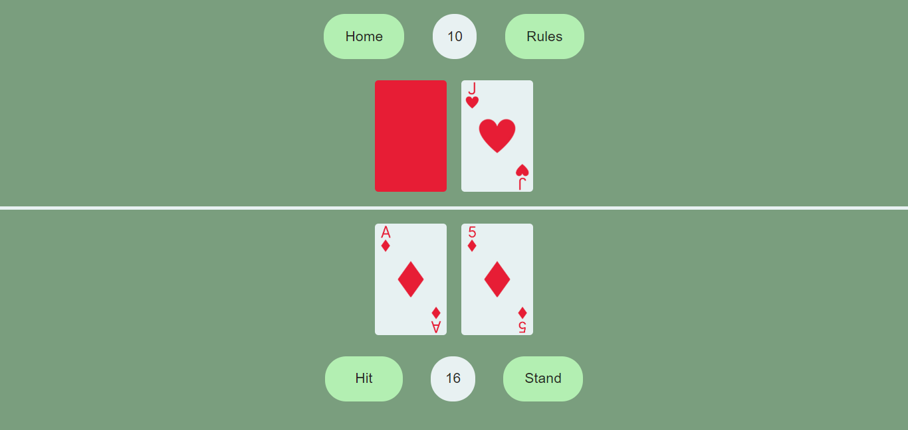
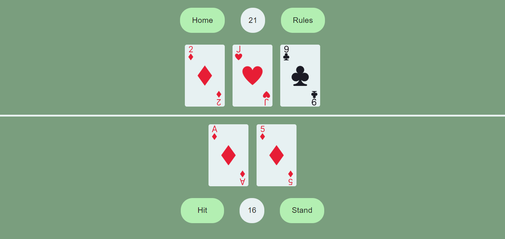
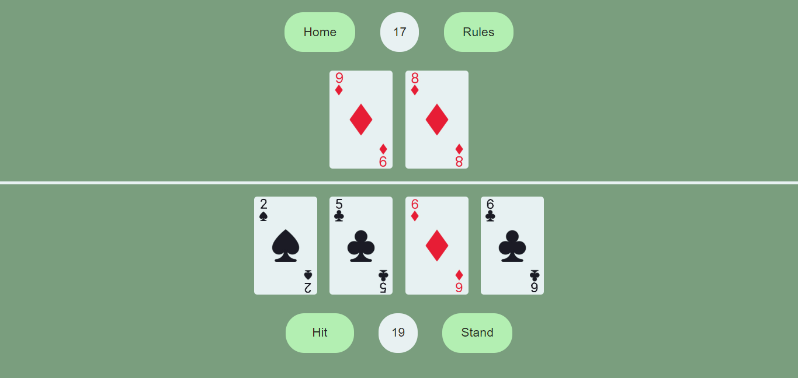

# Blackjack

Currently In Development

(Live Site will be added when I find an alternative to Heroku)

# Table Of Contents

- [Description](#description)
- [Visuals](#visuals)
- [TODO List](#todo-list)
- [Acknowledgements](#acknowledgement)

## Description

This project is a stepping stone in a personal goal to create a card game. 

Therefore, using the MERN stack, this blackjack game allows users to have a hand of two cards, to view their cards, and recieve new cards when requested. It follows the rules of blackjack, but it does not include any gambling elements. Rounds can be won by having a hand with a value closest to 21 without going over 21. The dealer also has a hand that impacts the win condition of the user if they are closer to 21.

## Visuals

This site is currently in development, so some visuals may be outdated.

Pictures Last Updated: September 26th, 2022

## TODO List

Below is a short list of developments that need to be implemented. It is not ordered in chronological order.

- Win/Loss Condition (including naturals/blackjack)
- Win/Loss Screen to Reset game
- Possible CSS animation for cards
- Extra Styling (and Mobile Styling)
- Deployment
- Turning app into Progressive Web Application (PWA)

## Acknowledgements 

Starter code and file structure in "Initial commit" was created by Anthony Cooper in the UNC Charlotte Coding Bootcamp.